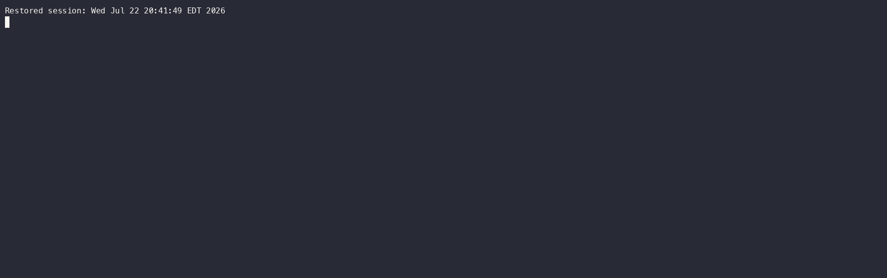
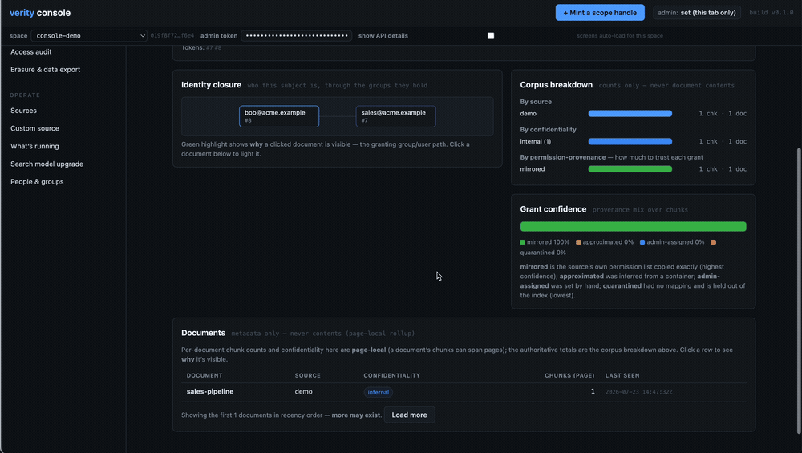

# Verity

**The open-source, permission-aware shared context plane for enterprise AI agents** — always fresh from systems of record, provably scoped, fast enough for the inner loop.

Enterprises run agents across sales, support, marketing, and ops, but each agent is an island: the context they need lives in CRMs, ticketing systems, docs, and wikis. Verity mirrors those systems of record into a bi-temporal memory store via CDC/webhooks, inherits source ACLs into a Zanzibar-style permission graph, compiles caller scope into every retrieval as a mandatory pre-filter, and serves scoped hybrid recall — exposed MCP-first to any agent framework.

**Status: v0.1.** The load-bearing claim is measured: **0 cross-entity leaks across 1,220
adversarial probes** and **0 stale reads** after CDC supersession (`verity-bench srb`; results
in [docs/benchmark/](docs/benchmark/)). The scope plane is fuzzed in CI, identity resolves
through SpiceDB, and the ingestion funnel is live (CLI, MCP, minted webhooks, file drop,
Google Drive/Gmail/HubSpot/Salesforce/Notion/Intercom connectors, Debezium CDC). Latency is
honest, not flat — point reads and BM25 stay fast at scale, while dense/hybrid recall rises
with corpus size, ACL selectivity, and cache state; the full measured curves with stated
conditions are in [docs/BENCHMARKS.md](docs/BENCHMARKS.md). What Verity does **not** do yet is
in [HONESTY.md](HONESTY.md). See [SPEC.md](SPEC.md) — the build contract — and
[docs/research/](docs/research/) for the research that produced it.

## The three claims

1. **Provable scoping** — an agent talking to customer A can never surface customer B's pricing. Enforcement is architectural (in-index pre-filters from a ReBAC permission graph, fail-closed), never delegated to the model.
2. **Live truth** — source change to queryable in seconds. "Opportunity updated" is a deterministic keyed upsert that structurally retires the old value; no LLM in the write path for structured data.
3. **Inner-loop speed** — point reads (~0.5ms) and BM25 (~23ms p95) stay fast at 1M chunks; dense/hybrid scoped recall is <50ms p95 warm at 100k chunks and rises with ACL selectivity and cache state at 1M (measured 75ms–~1.2s p95). Every number is measured with its conditions stated, never vendor-quoted — see [docs/BENCHMARKS.md](docs/BENCHMARKS.md).

## See claim #1 hold — 15 seconds, live



`all-staff ⊃ engineering ⊃ alice`; a confidential doc is shared with `all-staff`; **bob is in neither group.** Two agents connect over MCP naming only *who* they are — never a permission token. Alice's recall resolves the nested groups and sees the doc; bob's is dark, and **stays** dark when it tries a prompt-injection to pry it loose. The filter is compiled into the index, so a prompt can't argue past it. Exit code 0 = the boundary held.

Run it yourself (with `verity-cli dev` up): `python3 demo/two_agent_trust.py`.

## Layout

```
crates/verity-core      # types, bi-temporal memory model, StorageAdapter trait
crates/verity-storage   # Postgres profile (pgvector + pg_search) adapter
crates/verity-server    # API plane: REST now; MCP + gRPC to follow
crates/verity-bench     # the week-1 honesty benchmark: filtered-ANN latency at real ACL selectivity
ingest/                 # Python ingestion plane: connectors, enrichment (never on the read path)
migrations/             # SQL migrations (L0 evidence log, L1 bi-temporal facts, chunks)
deploy/                 # docker-compose for the Postgres profile
```

## Prerequisites

- **Docker**, running — `verity-cli dev` brings up the dev stack (Postgres/ParadeDB + SpiceDB + MinIO) via `docker compose`. Give Docker ~8 GB RAM.
- **Rust**, stable — the toolchain is pinned in `rust-toolchain.toml`, so `rustup` selects it automatically.
- **A C toolchain + build deps** for native crates (`rustup` does not ship a linker). On Debian/Ubuntu: `sudo apt install build-essential pkg-config libssl-dev cmake`. On macOS: `xcode-select --install`.
- ~20 GB free disk for container images and the release build.

## Quickstart (dev)

Run these from the repo checkout. **The first run builds the workspace from source and downloads a small local embedding model — budget ~15 minutes.** Every run after that starts in seconds.

```sh
cargo run --release -p verity-cli -- dev                             # compose up + server + tenant + org-wide scope handle
cargo run --release -p verity-cli -- add ./docs --visibility 1       # ingest a directory (visibility is required, never guessed)
cargo run --release -p verity-cli -- query "what do we know about pricing?"   # scoped hybrid recall with provenance tags
cargo run --release -p verity-cli -- webhook mint my-system --visibility 1    # any system that can POST JSON is now a source
```

Prefer `cargo install --path crates/verity-cli` to shorten `add`/`query`/`webhook` to bare `verity-cli ...` (they only talk to the server over HTTP). Note that `verity-cli dev` must still run from the repo checkout — it discovers the compose file and server binary relative to the source tree.

`verity-cli dev` is the *only* setup step. From there you can drive Verity three ways — the CLI above, the **web console** below, or **MCP** ([the next section](#connect-an-agent-mcp)) — all against the same running server.

### …or drive it from the browser (web console)



The console has a built-in **denial proof** (above): it runs one query through two sessions — your working handle, and a `proof-blind` session that holds no matching key — side by side. The blind session comes back with **0 memories** and the console says so in plain words: *an empty result is a safety answer, not a bug.* That refusal is the whole pitch, and you can watch it happen.

`verity-cli dev` prints a console link; open it in a browser (it's the same server, no extra setup):

```
http://127.0.0.1:7717/ui?tenant=<the tenant-id that dev printed>
```

A guided setup checklist takes you from zero, and the panels cover the whole loop without the CLI:

- **Playground** — run a scoped recall under a scope handle and see the hits it returns — then narrow the scope and watch what drops, so you can see the fail-closed pre-filter at work.
- **Memories / Ingest** — add a memory, or drop files, under an explicit visibility.
- **Sources** — connect a source (Google Drive, Gmail, HubSpot, and more) and back-fill it, so recall inherits that system's ACLs.
- **Scope** — paste a scope handle to decode it and run reads under it.
- **People & groups** and **Permission graph** — see who can see what, and *why* (the graph answers "what does X see / who sees Y").

The admin panels (People & groups, Permission graph) need `VERITY_ADMIN_TOKEN` when the server runs gated; a fresh `verity-cli dev` is auth-open, so they just work.

### …or wire it to an agent (MCP)

See [Connect an agent (MCP)](#connect-an-agent-mcp) below — point Claude Code (or any MCP-capable agent) at the same server and it gets scoped, permission-aware memory tools.

Benchmarks (`docs/BENCHMARKS.md` is the honesty log — every number measured, never quoted):

```sh
cargo run -p verity-bench -- seed --chunks 100000   # synthetic corpus with realistic ACL shape
cargo run -p verity-bench -- run                    # p50/p95/p99 per path; load --sweep for QPS
```

## Connect an agent (MCP)

`verity-mcp` is a stdio MCP server any MCP-capable agent (Claude Code, LangGraph,
CrewAI, ...) can use. Identity comes from the environment, never from tool arguments:

Use the tenant UUID and principal token that `verity-cli dev` printed (on a fresh `dev` tenant the `user:dev` token is `1`):

```sh
claude mcp add verity \
  -e VERITY_TENANT_ID=<tenant-uuid> -e VERITY_PRINCIPALS=1 \
  -e VERITY_ACTOR_SUB=user:you -e VERITY_ACTOR_AZP=agent:claude-code \
  -- /path/to/target/release/verity-mcp
```

Tools: `memory_open_scope` (mint a session scope), `memory_recall` (scoped hybrid
search), `memory_get` (bi-temporal record read), `memory_remember` (write an
observation), `memory_record_action` / `memory_activity` (the cross-agent activity
timeline — check what other agents did before acting), `memory_whoami`.

## License

Apache 2.0, permanently. One codebase. Nothing security-critical ever paywalled.

Verity is a trademark of AlphaLoops, Inc. The Apache-2.0 license covers the code, not the name or marks.
